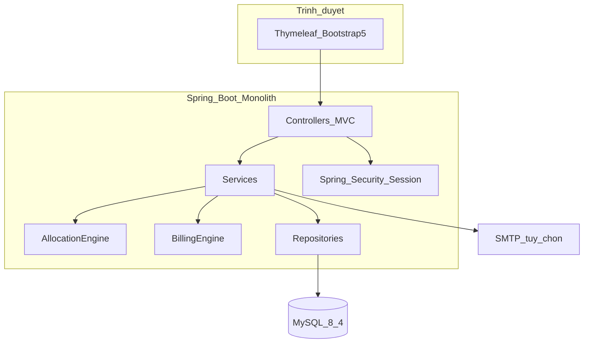

> Đặc tả chức năng & kỹ thuật **v1.6** (Approved) · [← Tổng quan](./01-tong-quan.md) · [Mục lục](./README.md) · [Mô hình dữ liệu →](./03-mo-hinh-du-lieu.md)

# 4. Thiết kế đề xuất (Proposed Design)

## 4.1. Kiến trúc tổng thể

Ứng dụng là **modular monolith**, layered Spring MVC:

```
┌──────────── Trình duyệt (Thymeleaf + Bootstrap 5 + Chart.js) ────────────┐
│  Form login (session cookie) · CSRF · flash message · fragment layout    │
└─────────────────────────────────┬────────────────────────────────────────┘
                                  │ HTTP
┌─────────────────────────────────▼────────────────────────────────────────┐
│  com.ktx.web  — Controller MVC (@Controller), không @RestController       │
│  AuthController, Admin*, Staff*, Student*                                 │
└─────────────────────────────────┬────────────────────────────────────────┘
                                  │
┌─────────────────────────────────▼────────────────────────────────────────┐
│  com.ktx.security — SecurityFilterChain, UserDetailsService, @PreAuthorize│
└─────────────────────────────────┬────────────────────────────────────────┘
                                  │
┌─────────────────────────────────▼────────────────────────────────────────┐
│  com.ktx.service — giao dịch @Transactional, AllocationEngine, BillingEngine │
│  com.ktx.scheduler — hết hạn HĐ, overdue+late fee, tự đóng ticket         │
└─────────────────────────────────┬────────────────────────────────────────┘
                                  │
┌─────────────────────────────────▼────────────────────────────────────────┐
│  com.ktx.repository — Spring Data JPA                                     │
│  com.ktx.domain — Entity / Enum                                           │
└─────────────────────────────────┬────────────────────────────────────────┘
                                  │ JDBC
                          ┌───────▼────────┐
                          │  MySQL 8.4 LTS │
                          └────────────────┘
         Tùy chọn: Spring Mail · Apache POI · OpenPDF · Chart.js CDN
```



**Nguyên tắc:**

- Một deployable: `java -jar ktx-app.jar` (embedded Tomcat) hoặc WAR trên Tomcat nếu giảng viên yêu cầu.
- Mọi ghi dữ liệu nghiệp vụ đi qua Service; Controller chỉ bind form / phân trang / flash.
- Entity không lộ ra view — dùng DTO / form object (`*Form`, `*View`).
- Cấu hình chính sách (giá điện, phụ phí, ngưỡng điểm) nằm bảng `system_configs`, không hard-code trong Java (trừ default seed).

## 4.2. Công nghệ & phiên bản đề xuất

| Thành phần | Lựa chọn                                          | Ghi chú                                                                                                                                                                    |
| ------------ | --------------------------------------------------- | --------------------------------------------------------------------------------------------------------------------------------------------------------------------------- |
| Java         | **25 LTS**                                          | Target compile/runtime. Boot 4.1 hỗ trợ JDK 17–26; máy chấm/demo cần Temurin 25                                                                                         |
| Spring Boot  | **4.1.x**                                           | Spring Framework 7. `spring-boot-starter-web`, `-thymeleaf`, `-security`, `-data-jpa`, `-validation`, `-mail`. Không dùng 3.3/3.4 (hết OSS)                   |
| Template     | Thymeleaf 3 +`thymeleaf-extras-springsecurity7`   | Layout:`layouts/main.html`                                                                                                                                                |
| UI           | Bootstrap 5.3 (webjars, patch mới nhất) + Icons   | Chart.js 4. Chi tiết màn hình, token, wireframe: [§24](./13-thiet-ke-ui-ux.md)                                                                                           |
| ORM          | Hibernate 7 (đi kèm Boot 4)                       | `ddl-auto=validate` sau khi có Flyway                                                                                                                                    |
| Migration    | Flyway                                              | `db/migration/V1__init.sql` …                                                                                                                                            |
| DB           | **MySQL 8.4 LTS**, InnoDB,`utf8mb4`               | Timezone`Asia/Ho_Chi_Minh`. Không dùng 8.0 (EOL 2026-04)                                                                                                                |
| Build        | Maven                                               | `pom.xml` packaging `jar`                                                                                                                                               |
| Export       | Apache POI (xlsx), OpenPDF (PDF)                    | Không iText 7 commercial                                                                                                                                                   |
| Test         | JUnit 5 + Spring Boot Test + H2 (unit)              | `AllocationEngineTest`, `BillingEngineTest` **không** chạm InnoDB. Race lock: IT profile MySQL local ([mục 6.3.6](./04-03-phan-bo.md), [PR-08](./12-pr-plan.md)) |

## 4.3. Cấu trúc package & thư mục

Base package: **`com.ktx`**.

```
E:/lehai/Documents/Project/BTL_Java_Web_QlyKiTucXa/
├── pom.xml
├── README.md
├── docs/                          # bản sao đặc tả (sau khi chốt)
└── src/
    ├── main/
    │   ├── java/com/ktx/
    │   │   ├── KtxApplication.java
    │   │   ├── config/
    │   │   │   ├── SecurityConfig.java
    │   │   │   ├── WebMvcConfig.java
    │   │   │   ├── MailConfig.java
    │   │   │   └── DataSeeder.java          # dev profile
    │   │   ├── security/
    │   │   │   ├── KtxUserDetails.java
    │   │   │   ├── KtxUserDetailsService.java
    │   │   │   └── LoginSuccessHandler.java
    │   │   ├── common/
    │   │   │   ├── exception/               # BusinessException, NotFoundException
    │   │   │   ├── advice/GlobalExceptionHandler.java
    │   │   │   ├── web/Pagination.java
    │   │   │   ├── security/StaffScope.java   # ADMIN bypass; STAFF theo tòa
    │   │   │   └── util/MoneyUtils.java, DateRanges.java, OccupyingStatuses.java
    │   │   ├── domain/                      # toàn bộ @Entity + enum
    │   │   ├── repository/
    │   │   ├── dto/                         # form + view model
    │   │   ├── service/
    │   │   │   ├── AuthService.java
    │   │   │   ├── StudentProfileService.java
    │   │   │   ├── BuildingService.java
    │   │   │   ├── RoomService.java
    │   │   │   ├── BedService.java
    │   │   │   ├── AssetService.java
    │   │   │   ├── RegistrationPeriodService.java
    │   │   │   ├── RoomApplicationService.java
    │   │   │   ├── AllocationEngine.java
    │   │   │   ├── AllocationService.java
    │   │   │   ├── ContractService.java
    │   │   │   ├── CheckInOutService.java
    │   │   │   ├── RoomChangeService.java
    │   │   │   ├── UtilityReadingService.java
    │   │   │   ├── BillingEngine.java
    │   │   │   ├── InvoiceService.java
    │   │   │   ├── TicketService.java
    │   │   │   ├── ViolationService.java
    │   │   │   ├── ConductService.java
    │   │   │   ├── DashboardService.java
    │   │   │   ├── ExportService.java
    │   │   │   ├── NotificationService.java
    │   │   │   ├── SystemConfigService.java
    │   │   │   └── DocumentNumberService.java   # HD-/INV- qua document_sequences
    │   │   ├── scheduler/
    │   │   │   ├── ContractExpiryReminderJob.java
    │   │   │   ├── InvoiceOverdueJob.java
    │   │   │   └── TicketAutoCloseJob.java
    │   │   └── web/
    │   │       ├── auth/AuthController.java
    │   │       ├── HomeController.java
    │   │       ├── admin/...
    │   │       ├── staff/...
    │   │       └── student/...
    │   └── resources/
    │       ├── application.yml
    │       ├── application-dev.yml
    │       ├── db/migration/
    │       ├── templates/
    │       │   ├── layouts/main.html
    │       │   ├── fragments/{navbar,sidebar,alerts,pagination}.html
    │       │   ├── auth/{login,register}.html
    │       │   ├── admin/...
    │       │   ├── staff/...
    │       │   └── student/...
    │       └── static/{css,js,images}/
    └── test/java/com/ktx/
        ├── service/AllocationEngineTest.java   # thuần bộ nhớ / H2 — không chứng minh lock
        ├── service/BillingEngineTest.java      # gồm case chia hết và case dư đồng
        └── it/AllocationLockIT.java            # profile it-mysql, máy local MySQL; không bắt Testcontainers
```

**Quy ước đặt tên:**

| Loại              | Quy ước                    | Ví dụ                                      |
| ------------------ | ---------------------------- | -------------------------------------------- |
| Entity / bảng     | PascalCase /`snake_plural` | `RoomApplication` → `room_applications` |
| Enum Java          | SCREAMING_SNAKE              | `BedStatus.VACANT`                         |
| Giá trị DB enum  | VARCHAR đúng tên enum     | `'VACANT'`                                 |
| Controller mapping | kebab / danh từ số nhiều  | `/admin/rooms/{id}/edit`                   |
| Service method     | động từ nghiệp vụ       | `commitRun`, `splitAndIssue`             |

## 4.4. Phân lớp HTTP & vai trò

| Role             | Mô tả                                                                          | Khu URL                                      |
| ---------------- | -------------------------------------------------------------------------------- | -------------------------------------------- |
| `ROLE_ADMIN`   | Toàn quyền: danh mục, đợt, phân bổ, hợp đồng, giá, user, báo cáo    | `/admin/**`                                |
| `ROLE_STAFF`   | Vận hành tòa được gán: ghi điện nước, ticket, check-in, vi phạm nhẹ | `/staff/**` (+ đọc `/admin` bị chặn) |
| `ROLE_STUDENT` | Hồ sơ, đơn, hợp đồng, hóa đơn, ticket, xin chuyển phòng              | `/student/**`                              |

Admin **không** dùng chung form đăng ký sinh viên. Tài khoản admin/staff do seeder + màn hình `/admin/users` tạo.

ADMIN được vào `/staff/**` (matcher `hasAnyRole(ADMIN, STAFF)`) và **bỏ qua** `StaffScope` (xem mọi tòa). STAFF vào `/admin/**` → 403.

---
