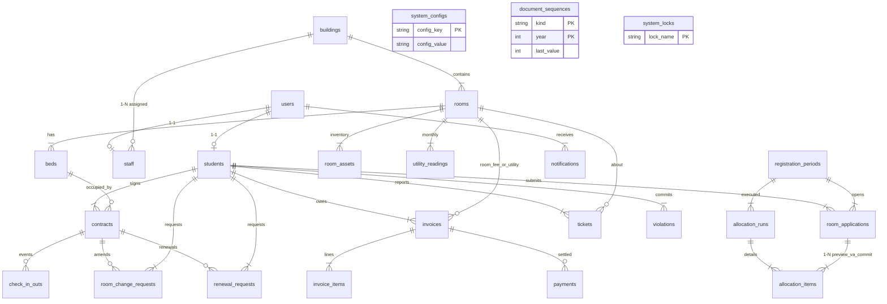

> Đặc tả chức năng & kỹ thuật **v1.6** (Approved) · [← Thiết kế](./02-thiet-ke.md) · [Mục lục](./README.md) · [Module xác thực →](./04-01-xac-thuc.md)

# 5. Mô hình dữ liệu (Data Model)

## 5.0. Tập trạng thái chiếm chỗ (đóng băng — mọi module phải dùng)

Đây là **một** định nghĩa duy nhất cho “sinh viên/giường đang bị chiếm”. Mọi unique key, validate nộp đơn, billing `N`, `roomBonus`, dashboard occupancy, `hasOverlapContract` đều tham chiếu hằng này (`OccupyingStatuses`).

| Tập                | Trạng thái`ContractStatus`                                          | Ý nghĩa vật lý                                                                          |
| ------------------- | ----------------------------------------------------------------------- | ------------------------------------------------------------------------------------------- |
| **OCCUPYING** | `DRAFT`, `ACTIVE`, `PENDING_RENEWAL`, `EXPIRED`, `TERMINATED` | Còn giữ giường. Unique`active_bed_key` / `active_student_key` **khác NULL**. |
| **FREE**      | `COMPLETED`                                                           | Không giữ giường. Unique key = NULL.                                                    |

**Hệ quả đã chốt:**

- Một sinh viên **tối đa một** hợp đồng OCCUPYING tại mọi thời điểm — kể cả khi hai đợt `SUMMER` và `NEW_ACADEMIC_YEAR` cùng `OPEN`. Gia hạn = sửa HĐ cũ, **không** tạo HĐ thứ hai.
- `DRAFT → COMPLETED` (`completion_reason = CANCELLED_BEFORE_CHECKIN`): hủy trước check-in, **cùng transaction** nhả giường. Không tạo dòng `check_in_outs`. Dùng `COMPLETED` (không phải `TERMINATED`) để generated unique key thực sự giải phóng giường — `TERMINATED` luôn còn chiếm chỗ cho đến khi checkout.
- `ACTIVE → TERMINATED` (buộc rời / trả sớm đã từng nhận phòng): giường **vẫn OCCUPIED** đến khi checkout.
- `PENDING_RENEWAL → EXPIRED` khi `end_date` đã qua mà chưa duyệt gia hạn; giường vẫn chiếm đến checkout.
- Checkout **chỉ** từ `ACTIVE | EXPIRED | TERMINATED` → `COMPLETED`, rồi mới `bed = VACANT`.
- Không tồn tại “DRAFT đã check-in”: check-in đổi `DRAFT → ACTIVE` trong cùng transaction.

Generated columns (MySQL 8.4, nhiều NULL được phép trên UNIQUE):

```sql
active_bed_key     BIGINT GENERATED ALWAYS AS
  (IF(status IN ('DRAFT','ACTIVE','PENDING_RENEWAL','EXPIRED','TERMINATED'), bed_id, NULL)) STORED,
active_student_key BIGINT GENERATED ALWAYS AS
  (IF(status IN ('DRAFT','ACTIVE','PENDING_RENEWAL','EXPIRED','TERMINATED'), student_id, NULL)) STORED,
UNIQUE KEY uk_contract_active_bed (active_bed_key),
UNIQUE KEY uk_contract_active_student (active_student_key)
```

## 5.1. ERD logic



## 5.2. Danh sách entity, trường khóa, ràng buộc

### 5.2.1. `users` — `User`

| Cột                            | Kiểu        | Ràng buộc                                                  |
| ------------------------------- | ------------ | ------------------------------------------------------------ |
| `id`                          | BIGINT PK AI |                                                              |
| `username`                    | VARCHAR(50)  | UNIQUE, NOT NULL. Sinh viên = MSSV; BQL = tên đăng nhập |
| `email`                       | VARCHAR(120) | UNIQUE, NOT NULL                                             |
| `password_hash`               | VARCHAR(100) | BCrypt                                                       |
| `role`                        | VARCHAR(20)  | `ADMIN` / `STAFF` / `STUDENT` — map `ROLE_*`        |
| `enabled`                     | BOOLEAN      | default true                                                 |
| `last_login_at`               | DATETIME     | nullable                                                     |
| `created_at` / `updated_at` | DATETIME     | auditing                                                     |

### 5.2.2. `students` — `Student`

| Cột                     | Kiểu        | Ràng buộc                                                                                                                              |
| ------------------------ | ------------ | ---------------------------------------------------------------------------------------------------------------------------------------- |
| `id`                   | BIGINT PK AI |                                                                                                                                          |
| `user_id`              | BIGINT       | UNIQUE FK → users                                                                                                                       |
| `student_code`         | VARCHAR(20)  | UNIQUE, trùng`users.username`                                                                                                         |
| `full_name`            | VARCHAR(120) | NOT NULL                                                                                                                                 |
| `gender`               | VARCHAR(10)  | `MALE` / `FEMALE` — **bắt buộc** để lọc tòa                                                                             |
| `date_of_birth`        | DATE         |                                                                                                                                          |
| `faculty_code`         | VARCHAR(30)  | vd`CNTT`                                                                                                                               |
| `class_code`           | VARCHAR(30)  | vd`D22CQCN01`                                                                                                                          |
| `phone`                | VARCHAR(20)  |                                                                                                                                          |
| `emergency_name`       | VARCHAR(120) | người thân                                                                                                                            |
| `emergency_phone`      | VARCHAR(20)  |                                                                                                                                          |
| `hometown`             | VARCHAR(120) |                                                                                                                                          |
| `priority_category`    | VARCHAR(30)  | `NONE`, `POLICY`, `REMOTE_AREA`                                                                                                    |
| `previous_stay_good`   | BOOLEAN      | default false;**chỉ admin tick tay** (thường cuối kỳ, sau khi xem vi phạm + hóa đơn). Không có job tự động lật cờ. |
| `conduct_score`        | INT          | default**100**, min 0                                                                                                              |
| `blocked_from_housing` | BOOLEAN      | default false (buộc rời / cấm đăng ký)                                                                                             |

Unique: `student_code`. Index: `(gender, faculty_code, class_code)`.

### 5.2.3. `staff` — `Staff`

| Cột                     | Kiểu        | Ràng buộc                            |
| ------------------------ | ------------ | -------------------------------------- |
| `id`                   | BIGINT PK AI |                                        |
| `user_id`              | BIGINT       | UNIQUE FK → users                     |
| `full_name`            | VARCHAR(120) | NOT NULL                               |
| `phone`                | VARCHAR(20)  |                                        |
| `assigned_building_id` | BIGINT       | **NOT NULL** FK → `buildings` |

Mọi user `ROLE_STAFF` **bắt buộc** một tòa. Tạo/sửa STAFF mà thiếu tòa → lỗi validate. ADMIN không có dòng `staff` (hoặc có cũng bị `StaffScope` bỏ qua). Không còn nghĩa “null = xem tất cả”.

### 5.2.4. `buildings` — `Building`

| Cột              | Ghi chú                                              |
| ----------------- | ----------------------------------------------------- |
| `code`          | UNIQUE`A`, `B`, `C`…                           |
| `name`          | `Tòa A — Nam`                                     |
| `gender_policy` | `MALE` / `FEMALE` — **không MIXED** ở v1 |
| `active`        | soft-disable                                          |

### 5.2.5. `rooms` — `Room`

| Cột               | Ghi chú                                                   |
| ------------------ | ---------------------------------------------------------- |
| `building_id`    | FK                                                         |
| `room_number`    | VARCHAR(10)                                                |
| `floor`          | INT                                                        |
| `room_type`      | `STANDARD_4`, `STANDARD_6`, `STANDARD_8`, `VIP_AC` |
| `capacity`       | 4/6/8/2 — phải khớp số giường                        |
| `price_per_term` | DECIMAL(12,0) VND / kỳ                                    |
| `status`         | `ACTIVE`, `MAINTENANCE`, `INACTIVE`                  |

Unique: `(building_id, room_number)`. Index: `(building_id)`, `(status)`.

### 5.2.6. `beds` — `Bed`

| Cột                    | Ghi chú                                                                                                   |
| ----------------------- | ---------------------------------------------------------------------------------------------------------- |
| `room_id`             | FK                                                                                                         |
| `bed_code`            | `G1`…`G8`                                                                                             |
| `status`              | `VACANT`, `OCCUPIED`, `MAINTENANCE`                                                                  |
| `current_contract_id` | nullable,**không** FK cứng tới `contracts` (cache; tránh vòng FK InnoDB không defer được) |
| `version`             | `@Version` optimistic backup                                                                             |

Unique: `(room_id, bed_code)`. Index: `(status)`, `(room_id, status)`. **Không** có `building_id` trên `beds` — lọc tòa qua `rooms.building_id`.

**Nguồn sự thật chỗ ở:** hợp đồng `status ∈ OCCUPYING` (mục 5.0). `beds.status` + `beds.current_contract_id` là cache. Mọi gán/nhả **phải** cùng transaction, **thứ tự bắt buộc** (InnoDB không deferred FK):

1. `INSERT contracts` (`bed_id` đã set, `status=DRAFT`) — lấy `contract.id`.
2. `UPDATE beds SET status=OCCUPIED, current_contract_id=:id WHERE id=:bedId AND status='VACANT'`. Nếu `updated != 1` → rollback.
3. Không `ON DELETE CASCADE` từ contract → bed.

Admin recovery: `RoomService.reconcileOccupancy()` so `beds.OCCUPIED` với HĐ OCCUPYING; nút “Sửa theo hợp đồng” trên `/admin/rooms/occupancy-drift`.

### 5.2.7. `room_assets` — `RoomAsset`

`room_id`, `name`, `category` (`FAN`,`BED_FRAME`,`CABINET`,`DESK`,`ELECTRIC_METER`,`WATER_METER`,`AC`,`OTHER`), `quantity`, `condition` (`GOOD`,`DAMAGED`,`MAINTENANCE`), `note`. Công tơ điện/nước: 1 bản ghi/phòng, `serial_number` optional.

### 5.2.8. `registration_periods` — `RegistrationPeriod`

| Cột                          | Ghi chú                                                       |
| ----------------------------- | -------------------------------------------------------------- |
| `name`                      | `Đợt tân SV 2026`                                         |
| `period_type`               | `FRESHMAN`, `NEW_ACADEMIC_YEAR`, `SUMMER`                |
| `academic_year`             | `2026-2027`                                                  |
| `open_at` / `close_at`    | cửa sổ nộp đơn                                            |
| `term_start` / `term_end` | ngày hợp đồng mặc định                                  |
| `status`                    | `DRAFT`, `OPEN`, `CLOSED`, `ALLOCATING`, `COMPLETED` |
| `created_by`                | user_id                                                        |

Chỉ **một** period `OPEN` cùng `period_type` tại một thời điểm (enforce ở service).

### 5.2.9. `room_applications` — `RoomApplication`

| Cột                            | Ghi chú                                                                                           |
| ------------------------------- | -------------------------------------------------------------------------------------------------- |
| `period_id`, `student_id`   | UNIQUE cặp                                                                                        |
| `preferred_building_id`       | nullable                                                                                           |
| `preferred_room_type`         | nullable = chấp nhận mọi loại                                                                  |
| `priority_snapshot`           | copy`Student.priority_category` lúc nộp                                                        |
| `previous_stay_good_snapshot` | boolean                                                                                            |
| `status`                      | `DRAFT`, `SUBMITTED`, `WITHDRAWN`, `ALLOCATED`, `WAITLISTED`, `REJECTED`               |
| `submitted_at`                | NOT NULL khi SUBMITTED                                                                             |
| `computed_score`              | INT, cache lúc nộp;`plan()` **tính lại** từ snapshot + weight hiện tại ([mục 6.3.3](./04-03-phan-bo.md)) |
| `note`                        | VARCHAR(500)                                                                                       |

Sinh viên **không được** có bất kỳ hợp đồng `OCCUPYING` nào khi nộp đơn mới hoặc khi bị gán giường (unique `active_student_key` là lớp chặn cuối).

### 5.2.10. `allocation_runs` / `allocation_items`

`AllocationRun`: `period_id`, `dry_run` BOOLEAN, `status` (`PENDING`,`RUNNING`,`COMPLETED`,`FAILED`,`COMMITTED`,`DISCARDED`), `started_at`, `finished_at`, `run_by`, `summary_json` (số assigned/waitlisted), `seed_note`, `weights_json` TEXT nullable (audit: weight/`mode` lúc `plan()` của run đó; **commit luôn đọc config sống**, không có UI “chốt đúng preview”).

`AllocationItem`: `run_id`, `application_id`, `student_id`, `bed_id` nullable, `rank_no`, `score`, `result` (`ASSIGNED`,`WAITLISTED`,`SKIPPED`), `reason` (`NO_VACANT_BED`, `NO_TYPE_MATCH`, `NO_BUILDING_MATCH`, `SKIPPED_ALREADY_HOUSED`, `SKIPPED_BLOCKED`, `NO_GENDER_MATCH` — lý do phòng thủ nếu giới tính/tòa đổi giữa preview và commit).

Một `room_application` có **nhiều** `allocation_items` (mỗi preview/commit một dòng). Map `result` → `ApplicationStatus` khi **commit** ([mục 6.3.7](./04-03-phan-bo.md)).

Không xóa run đã `COMMITTED`.

### 5.2.11. `contracts` — `Contract`

| Cột                         | Ghi chú                                                                                 |
| ---------------------------- | ---------------------------------------------------------------------------------------- |
| `contract_no`              | UNIQUE`HD-2026-000123` — cấp bởi `DocumentNumberService` / `document_sequences` |
| `student_id`, `bed_id`   |                                                                                          |
| `application_id`           | nullable (hợp đồng tay)                                                               |
| `start_date`, `end_date` |                                                                                          |
| `room_fee`                 | snapshot`Room.price_per_term`                                                          |
| `deposit_amount`           | snapshot, VND nguyên, HALF_UP(`price_per_term * deposit.ratio`)                       |
| `deposit_status`           | `HELD`, `REFUNDED`, `FORFEITED`                                                    |
| `status`                   | xem mục 5.0                                                                             |
| `completion_reason`        | nullable:`NORMAL_CHECKOUT`, `CANCELLED_BEFORE_CHECKIN`, `FORCED_AFTER_CHECKOUT`    |
| `terms_version`            | VARCHAR                                                                                  |
| `signed_at`                |                                                                                          |

Index: `(student_id, status)`, `(bed_id, status)`, `(end_date)`. Generated UNIQUE `active_bed_key`, `active_student_key` (mục 5.0).

### 5.2.12. `check_in_outs` — `CheckInOut`

`contract_id`, `event_type` (`CHECK_IN`,`CHECK_OUT`), `performed_at`, `performed_by`, `asset_note` (TEXT — bàn giao), `ok` BOOLEAN.

### 5.2.13. `room_change_requests` — `RoomChangeRequest`

`student_id`, `contract_id`, `current_bed_id`, `requested_building_id`, `requested_room_type`, `reason`, `target_bed_id` (admin chọn), `status` (`SUBMITTED`,`APPROVED`,`REJECTED`,`COMPLETED`,`CANCELLED`), `admin_note`.

Loại `RETURN_ROOM` dùng cùng bảng với `request_kind` = `CHANGE` | `RETURN`.

### 5.2.14. `renewal_requests` — `RenewalRequest` (V1, không chờ PR-11 mới nghĩ schema)

| Cột                            | Ghi chú                                                 |
| ------------------------------- | -------------------------------------------------------- |
| `id`                          | BIGINT PK AI                                             |
| `student_id`                  | FK                                                       |
| `contract_id`                 | FK                                                       |
| `requested_end`               | DATE —`end_date` mới đề xuất                      |
| `status`                      | `SUBMITTED`, `APPROVED`, `REJECTED`, `CANCELLED` |
| `admin_note`                  | VARCHAR(500)                                             |
| `created_at` / `decided_at` |                                                          |

Khi tạo đơn `SUBMITTED`: HĐ `ACTIVE → PENDING_RENEWAL`. **Duyệt:** `end_date = requested_end`, HĐ `PENDING_RENEWAL → ACTIVE`. **Từ chối / SV hủy:** HĐ `PENDING_RENEWAL → ACTIVE`, **giữ nguyên** `end_date` (để RETURN/checkout chạy được). Timeout `end_date < today` khi đơn còn `SUBMITTED`: HĐ `PENDING_RENEWAL → EXPIRED` (đơn → `CANCELLED` bởi job, ghi `admin_note=EXPIRED`).

### 5.2.15. `utility_readings` — `UtilityReading`

Unique `(room_id, billing_month)` với `billing_month` DATE = ngày 1 của tháng.

| Cột                                                         | Quy tắc                                                                                 |
| ------------------------------------------------------------ | ---------------------------------------------------------------------------------------- |
| `elec_prev`, `elec_curr`, `water_prev`, `water_curr` | INT ≥ 0                                                                                 |
| `elec_replaced`                                            | BOOLEAN default false — thay**công tơ điện**                                  |
| `water_replaced`                                           | BOOLEAN default false — thay**công tơ nước** (độc lập)                     |
| `elec_old_final`, `elec_new_start`                       | **bắt buộc** khi `elec_replaced`                                               |
| `water_old_final`, `water_new_start`                     | **bắt buộc** khi `water_replaced`                                              |
| `new_building_meter`                                       | true = lần đọc đầu tòa/công tơ mới; cho phép prev = 0 sau khi admin xác nhận |
| `recorded_by`, `recorded_at`                             |                                                                                          |

Không còn cột `meter_replaced`. Công thức — [mục 6.5.1](./04-05-dien-nuoc.md). Cấm `curr < prev` trên utility **không** thay công tơ. Từ chối lập hóa đơn nếu tiêu thụ null hoặc âm.

### 5.2.16. `invoices`, `invoice_items`, `payments`

`Invoice`: `invoice_no` UNIQUE (cấp `document_sequences` kind `INVOICE_NO`), `student_id`, `room_id`, `contract_id` nullable, `invoice_type` (`ROOM_TERM`,`UTILITY`,`DEPOSIT`,`OTHER`), `billing_month` nullable, `subtotal`, `late_fee` default 0, `total` (= `subtotal + late_fee`), `due_date`, `status` (`UNPAID`,`PAID`,`OVERDUE`,`CANCELLED`), `paid_at`, `idempotency_key` VARCHAR(80) **UNIQUE NOT NULL**.

Quy ước `idempotency_key` (idempotent phát hành):

| Loại         | Key                                        |
| ------------- | ------------------------------------------ |
| `UTILITY`   | `UTILITY:{studentId}:{roomId}:{yyyy-MM}` |
| `ROOM_TERM` | `ROOM_TERM:{contractId}`                 |
| `DEPOSIT`   | `DEPOSIT:{contractId}`                   |
| `OTHER`     | `OTHER:{contractId}:{suffix}`            |

Logical key ổn định như bảng trên. **Khi hủy hóa đơn** (`CANCELLED`), **cùng transaction** đổi `idempotency_key` cũ thành `{old}:cancelled:{invoiceId}` (tombstone, vẫn UNIQUE) rồi mới được insert hóa đơn mới với logical key gốc. Không reuse hàng đã hủy (giữ audit). `VARCHAR(80)` đủ: `UTILITY:{id}:{id}:{yyyy-MM}:cancelled:{id}`.

Bỏ qua phát hành khi đã tồn tại hàng **cùng logical key** và `status != CANCELLED`. Hàng `CANCELLED` không chặn insert mới.

`InvoiceItem`: `description`, `qty`, `unit_price`, `amount`, `item_code` (`ELEC`,`WATER`,`SANITATION`,`INTERNET`,`PARKING`,`ROOM`,`DEPOSIT`,`LATE_FEE`). **`sum(items.amount) = invoice.total`** luôn.

`Payment`: `invoice_id`, `amount`, `method` (`CASH`,`BANK_TRANSFER`), `paid_at`, `recorded_by`, `reference_no`. Tổng payment ≥ `total` → `PAID`.

### 5.2.17. `document_sequences` — `DocumentSequence`

PK `(kind, year)`: `kind` ∈ {`CONTRACT_NO`,`INVOICE_NO`}, `last_value` INT. Cấp số: `SELECT … FOR UPDATE` cùng TX với insert HĐ/hóa đơn, `last_value++`, format `HD-{year}-{n:06d}` / `INV-{year}-{n:06d}`. Cấm `MAX(contract_no)+1`.

### 5.2.18. `system_locks` — `SystemLock`

`lock_name` VARCHAR(40) PK. Seed một hàng `ALLOCATION`. Chỉ `assignManual` **không** `periodId` (gán giữa kỳ) `SELECT … FOR UPDATE` hàng này — serialize các lần gán tay không đợt. `commit` **không** lấy khóa này. Đụng độ với commit đợt khác / gán tay đợt khác: UNIQUE `active_bed_key` / `active_student_key`.

### 5.2.19. `tickets` — `MaintenanceTicket`

`student_id`, `room_id`, `title`, `description`, `priority` (`LOW`,`MEDIUM`,`HIGH`), `status` (`OPEN`,`IN_PROGRESS`,`RESOLVED`,`CLOSED`,`REJECTED`), timestamps. `resolved_at` dùng cho job tự đóng 7 ngày.

### 5.2.20. `violations` — `Violation`

`student_id`, `recorded_by`, `violation_type` (`LATE_RETURN`,`ILLEGAL_COOKING`,`DISTURBANCE`,`DAMAGE`,`OTHER`), `severity` (`MINOR`,`MAJOR`,`SEVERE`), `points_deducted`, `description`, `occurred_at`, `action` (`WARNING`,`POINT_DEDUCT`,`TERMINATE`). Điểm mặc định: [mục 6.6](./04-06-su-co-vi-pham.md).

### 5.2.21. `notifications` — `Notification`

`user_id`, `title`, `body`, `type` (`CONTRACT_EXPIRY`,`INVOICE`,`ALLOCATION`,`TICKET`,`GENERIC`), `read_flag`, `created_at`. Tùy chọn `email_sent`.

### 5.2.22. `system_configs` — `SystemConfig`

`config_key` UNIQUE, `config_value` TEXT, `value_type` (`STRING`,`INT`,`DECIMAL`,`JSON`,`BOOLEAN`), `description`.

Danh mục key đầy đủ + default: **[Phụ lục C](./11-phu-luc.md)**. `V2__seed_config.sql` copy nguyên bảng đó.

## 5.3. Enum tập trung (`com.ktx.domain.enums`)

`Role`, `Gender`, `BuildingGenderPolicy`, `RoomType`, `RoomStatus`, `BedStatus`, `AssetCategory`, `AssetCondition`, `PeriodType`, `PeriodStatus`, `ApplicationStatus`, `PriorityCategory`, `AllocationRunStatus`, `AllocationResult`, `ContractStatus`, `CompletionReason`, `DepositStatus`, `CheckInOutType`, `RoomChangeKind`, `RoomChangeStatus`, `RenewalStatus`, `InvoiceType`, `InvoiceStatus`, `PaymentMethod`, `TicketStatus`, `TicketPriority`, `ViolationType`, `ViolationSeverity`, `ViolationAction`, `NotificationType`.

Hằng `OccupyingStatuses.OCCUPYING` / `FREE` không phải enum DB — tập hợp trên `ContractStatus`.

## 5.4. Chiến lược migration

1. Flyway `V1__init.sql` — toàn bộ bảng + index + generated unique + seed `system_locks('ALLOCATION')` + `document_sequences` năm hiện tại = 0.
2. `V2__seed_config.sql` — **toàn bộ** key [Phụ lục C](./11-phu-luc.md).
3. Profile `dev`: `DataSeeder` tạo 1 admin, 1 staff, vài tòa/phòng/giường, 20 sinh viên mẫu.
4. Production/demo giảng viên: `spring.jpa.hibernate.ddl-auto=validate`.
5. Không dùng `ddl-auto=update` sau V1.

Mọi thay đổi schema = file Flyway mới, không sửa V1 đã merge.
