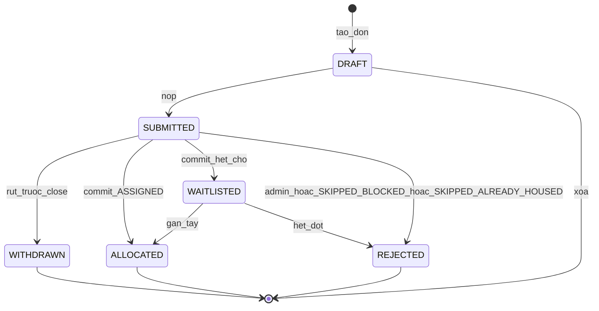
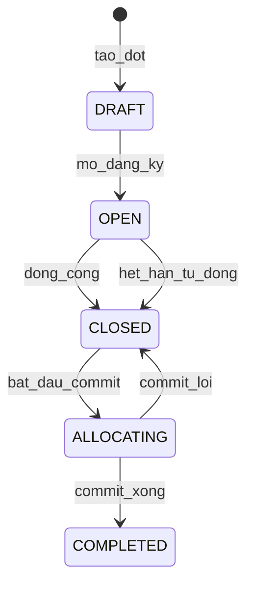
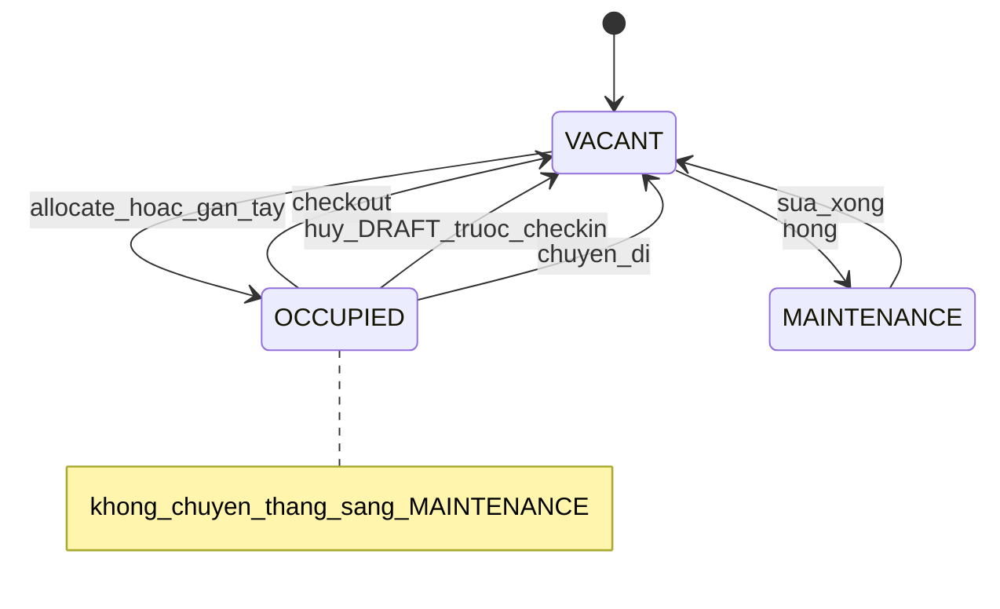
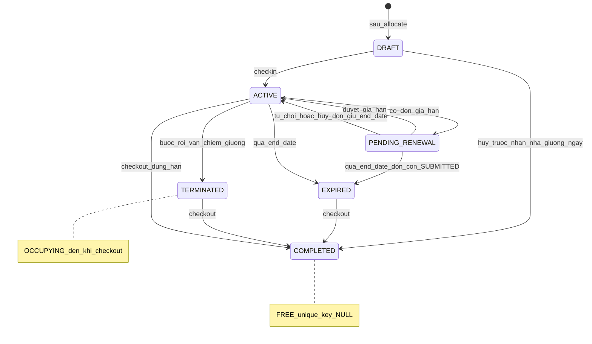
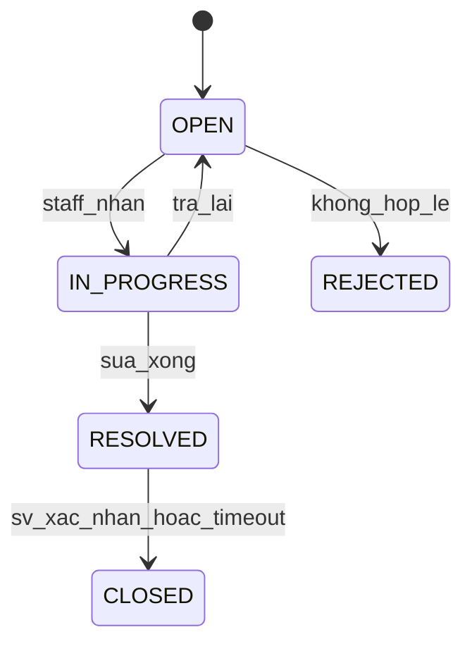
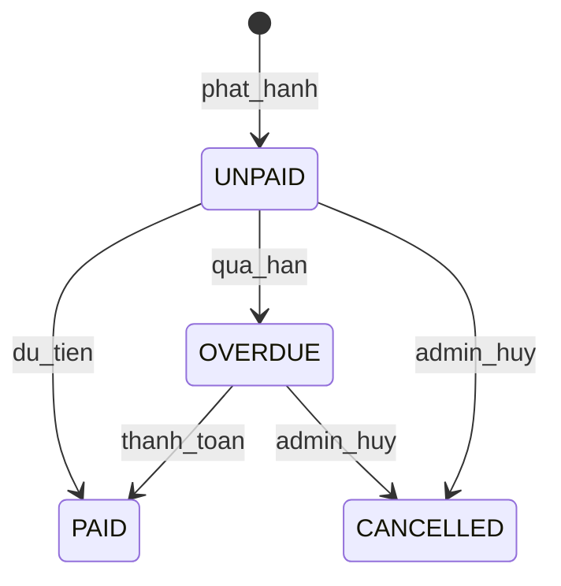
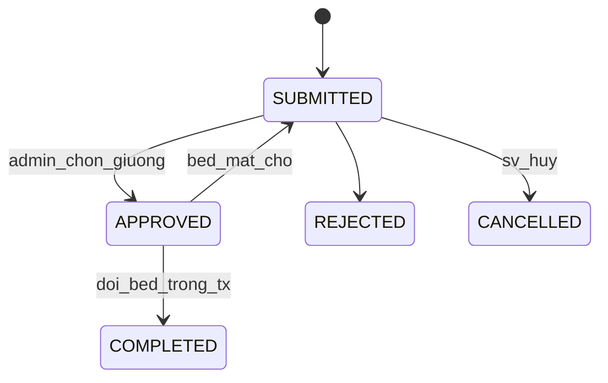

> Đặc tả chức năng & kỹ thuật **v1.6** (Approved) · [← API & Java](./05-api-va-giao-dien-java.md) · [Mục lục](./README.md) · [Sequence →](./07-sequence.md)

# 9. Máy trạng thái (State machines)

---
