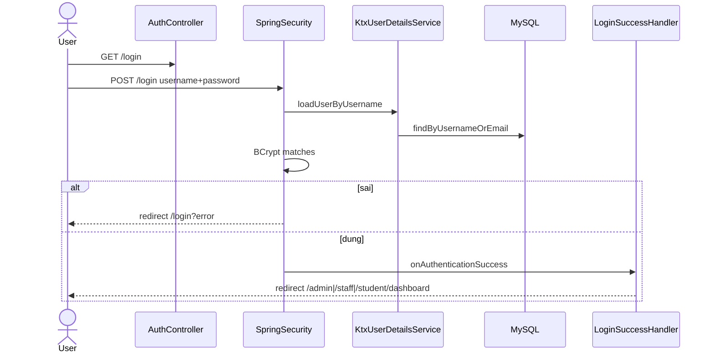
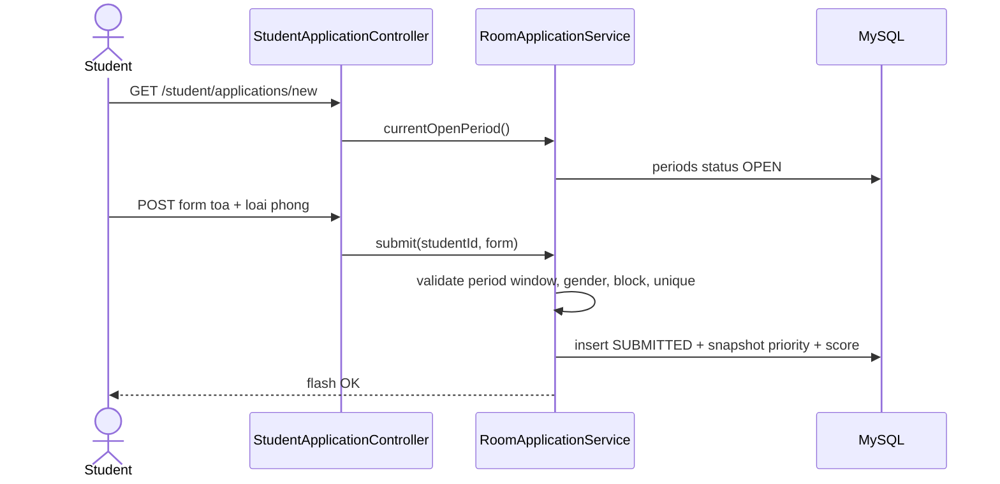
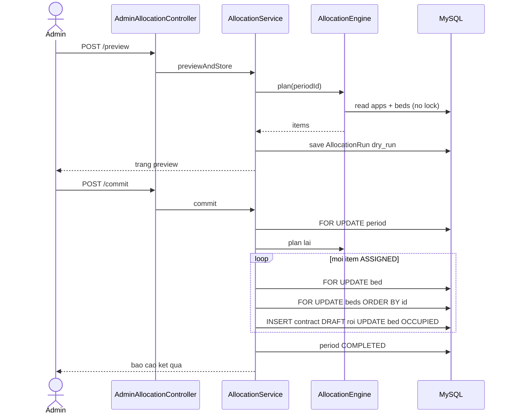
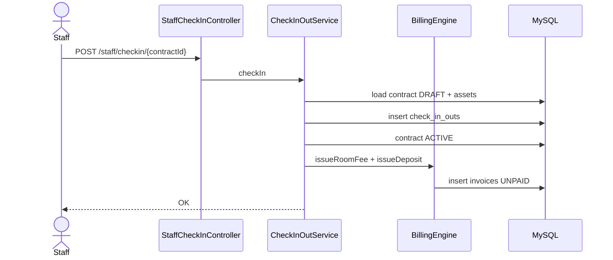
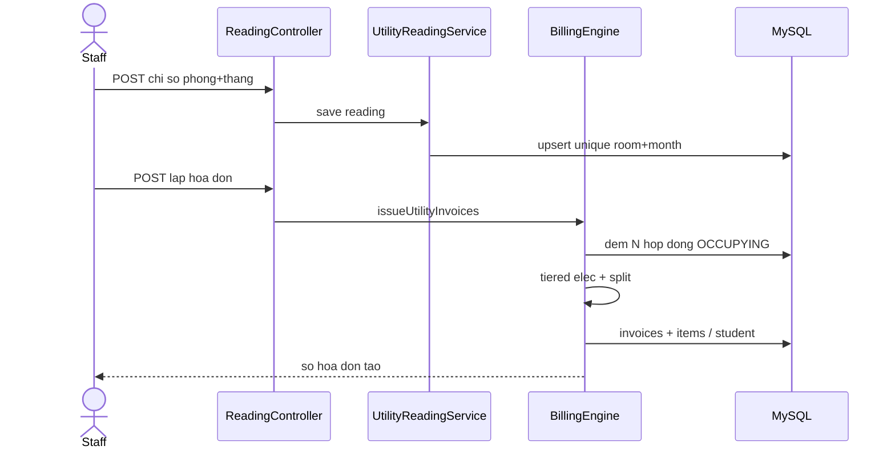

> Đặc tả chức năng & kỹ thuật **v1.6** (Approved) · [← Máy trạng thái](./06-may-trang-thai.md) · [Mục lục](./README.md) · [Bảo mật →](./08-bao-mat-va-van-hanh.md)

# 10. Sequence diagrams

## 10.1. Đăng nhập

## 10.2. Sinh viên nộp đơn

## 10.3. Auto-allocate (preview + commit)

## 10.4. Check-in

## 10.5. Billing tháng

---
