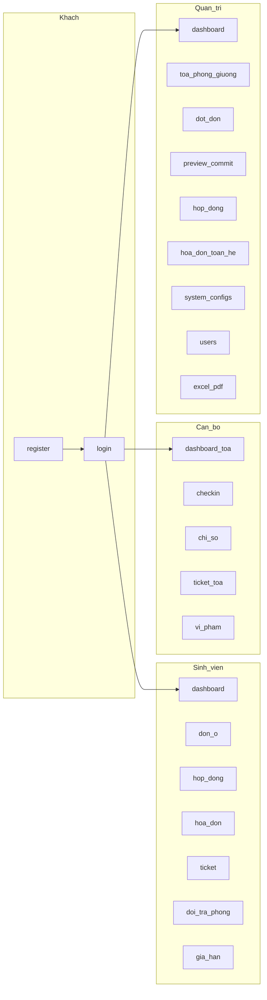

> Đặc tả chức năng & kỹ thuật **v1.6** (Approved) · [← PR Plan](./12-pr-plan.md) · [Mục lục](./README.md)

# 24. Thiết kế giao diện (UI/UX)

Tài liệu này **bổ sung** các mục 6.x (URL, quy tắc) và [§4.3](./02-thiet-ke.md) (cây template). Không đổi stack: Thymeleaf + Bootstrap 5.3 + Chart.js 4; không SPA. Mọi path phải khớp module 6 — nếu lệch, **module 6 thắng**.

---

## 24.1. Mục tiêu & ngoài phạm vi

**Mục tiêu**

- Ba portal cùng một hệ thống nhưng **không cùng mật độ**: admin = bàn làm việc, staff = ca trực một tòa, sinh viên = cổng tự phục vụ.
- Mọi quyết định phân bổ / tiền / giường **giải trình được trên màn hình** (hạng, điểm, lý do nới, số giường, số tiền VND).
- Form server-rendered: CSRF, flash, field error; không `fetch` bỏ token.

**Ngoài phạm vi v1**

- Design system riêng ngoài Bootstrap (không Tailwind, không React).
- Dark mode, i18n đa ngữ, PWA, mobile native.
- Upload ảnh, kéo-thả giường, sơ đồ 3D.
- Toast realtime (WebSocket). Notification = badge + trang danh sách + flash sau POST.

---

## 24.2. Người dùng & việc cần xong (jobs)

| Persona | Việc chính trên UI | Không được thấy |
| --- | --- | --- |
| **Sinh viên** | Đăng ký/đăng nhập; nộp/rút đơn; xem HĐ, hóa đơn; ticket; xin đổi/trả phòng; gia hạn | `/admin/**`, danh sách giường trống toàn hệ, nút commit |
| **Cán bộ tòa (STAFF)** | Check-in/out tòa mình; ghi chỉ số; lập HĐ một phòng; ticket/vi phạm nhẹ | Preview/commit phân bổ, `assignManual`, `/admin/configs`, CRUD user, phát hành cả tòa |
| **Quản trị (ADMIN)** | Toàn bộ danh mục + đợt + preview/commit + báo cáo + cấu hình giá | Form `/register` (không tự đăng ký admin) |

Luồng demo 15 phút (PR-18) phải đi được **không cần giải thích sidebar**: Đăng nhập admin → đợt → preview → chốt → check-in (staff) → ghi chỉ số → lập hóa đơn.

---

## 24.3. Ngôn ngữ hình ảnh (trắng, clean, hiện đại)

**Chuẩn thị giác:** [docs/image/exampleUI.png](./image/exampleUI.png) — dashboard sáng, sidebar trắng, card bo góc, accent tím, KPI pastel.

Không dùng theme cũ (nền linen, sidebar mực `#173A4A`, nút đồng brass, serif công văn). Đó là bản §24 trước v1.6 — **đã hủy**.

**Tinh thần:** phòng lab / phần mềm quản trị 2026: nhiều khoảng trắng, chữ sans, bóng rất nhẹ, không texture gỗ/công văn. Vẫn Thymeleaf + Bootstrap 5.3; ghi đè token trong `ktx.css`.

**Chữ ký nhận diện (giữ, đổi skin):** mã cửa (`A-101`, `G3`), số HĐ / hóa đơn là **chip mã** — font mono, nền `#F3F0FF`, chữ `violet`, bo pill. Không tấm biển giả kim loại.

### 24.3.1. Màu

Lấy từ mock `exampleUI.png` (xấp xỉ, chốt hex):

| Token | Hex | Dùng |
| --- | --- | --- |
| `canvas` | `#F4F6FB` | Nền trang (xám-trắng lạnh, không kem) |
| `surface` | `#FFFFFF` | Sidebar, card, bảng, topbar |
| `line` | `#E8EBF3` | Viền card, divider |
| `ink` | `#1E293B` | Chữ chính (không còn là màu sidebar) |
| `muted` | `#64748B` | Nhãn phụ, meta |
| `violet` | `#6D5EF5` | Primary: menu active, CTA, donut “đang dùng”, link |
| `violet-soft` | `#F3F0FF` | Nền mục sidebar đang chọn, chip mã, tile “Thêm SV” |
| `sky` | `#38BDF8` | Giường trống trên chart / tile |
| `mint` | `#22C55E` | Success, PAID, ALLOCATED, thanh “đang dùng” |
| `peach` | `#F97316` | Bảo trì, waitlist, OVERDUE nhẹ |
| `rose` | `#F43F5E` | Danger, TERMINATED, badge ưu tiên cao |
| `lilac-tile` | `#EEE9FE` | Nền icon KPI / thao tác nhanh (luân phiên mint/peach/sky) |

Ghi đè Bootstrap: `--bs-primary: #6D5EF5`, `--bs-body-bg: #F4F6FB`, `--bs-body-color: #1E293B`. **Không** `#0d6efd`. Không dark sidebar.

### 24.3.2. Chữ

| Vai trò | Font | Cỡ |
| --- | --- | --- |
| Toàn UI (tiêu đề + body) | **Plus Jakarta Sans** | Body 14–15px; H1 1.375rem semibold |
| Số KPI | cùng family, extrabold | 1.75rem, tracking chặt |
| Mã cửa, số chứng từ | **IBM Plex Mono** | 12–13px trong chip |

Không Source Serif, không Inter/Roboto. Tiêu đề **không** serif — mock là sans hiện đại.

### 24.3.3. Layout khung

Khớp mock: sidebar **trắng**, topbar **trắng**, canvas xám nhạt. Một `layouts/main.html`.

```
ADMIN / STAFF (ops)                         STUDENT (portal)
┌────────┬──────────────────────────┐      ┌────────────────────────────┐
│ 248px  │ topbar trắng: hamburger  │      │ topbar trắng: logo · menu  │
│ trắng  │  tiêu đề · search · chuông│      │         · tên · thoát      │
│ shadow │  avatar tím              │      ├────────────────────────────┤
│ nhẹ    │──────────────────────────│      │                            │
│ logo   │                          │      │   nội dung tối đa 960px    │
│ nhóm   │   canvas #F4F6FB         │      │   card trắng               │
│ menu   │   card trắng bo 16px     │      │                            │
└────────┴──────────────────────────┘      └────────────────────────────┘
```

- Sidebar cố định, item active = nền `violet-soft` + chữ `violet` (như “Tổng quan” trên mock).
- Card: `border-radius: 16px`; `box-shadow: 0 1px 2px rgba(15,23,42,.04)`; viền `line`.
- Search trên topbar (admin/staff): placeholder “Tìm sinh viên, phòng, đơn…”. v1 = form GET `/admin/search?q=` (tối thiểu user + phòng + đơn); không bắt buộc shortcut Ctrl+K.
- Auth: nền `canvas`, card trắng giữa, logo + accent `violet`. **Không** nền tối.
- `403` / `404`: cùng nền sáng + nút primary violet.

---

## 24.4. Thông tin kiến trúc (sitemap)



**Sidebar ADMIN** (nhóm, đúng thứ tự vận hành):

1. Tổng quan → `/admin/dashboard`
2. Hạ tầng → Tòa, Phòng, Lệch occupancy
3. Phân bổ → Đợt, Đơn, Preview/chốt, Gán tay
4. Lưu trú → Hợp đồng, Đổi/trả phòng, Gia hạn
5. Viện phí → Chỉ số, Hóa đơn, Thanh toán
6. Vận hành → Ticket, Vi phạm
7. Hệ thống → Người dùng, Cấu hình, Báo cáo

**Sidebar STAFF** (rút): Tổng quan tòa · Phòng tòa · Check-in · Chỉ số · Hóa đơn phòng · Ticket · Vi phạm. Không mục Phân bổ / Cấu hình / Users.

**Topnav STUDENT:** Trang chủ · Đơn ở · Hợp đồng · Hóa đơn · Sự cố · Hồ sơ.

Mục không có quyền: **không render** (Thymeleaf `sec:authorize`). Không xám + tooltip “liên hệ admin” trừ khi đó là hành động nghiệp vụ (ví dụ SV `blocked_from_housing` vẫn thấy Đơn ở nhưng form khóa + lý do).

---

## 24.5. Thành phần dùng lại

Fragment: `navbar`, `sidebar`, `alerts`, `pagination` (đã nêu §4.3) + thêm `chip`, `status-badge`, `confirm-modal`, `page-header`.

| Thành phần | Quy tắc |
| --- | --- |
| **Page header** | H1 sans semibold + 1 câu `muted` + nút phải (`btn` primary `violet`) |
| **Chip mã** | `<span class="ktx-chip">A-101 · G3</span>` — nền `violet-soft`, chữ `violet` |
| **Badge trạng thái** | Chỉ enum đã chốt. Map màu §24.6. Text tiếng Việt (Đang ở, Nháp, Chờ chỗ…) |
| **Bảng list** | `table-hover`; cột số/tiền `text-end` + format `1.234.567 đ`; 20 dòng/trang |
| **Form** | Label trên field; `is-invalid` + `th:errors`; hint nhỏ dưới field (vd. MSSV 8–12 ký tự) |
| **Flash** | `alerts.html`: success xanh `vacant`, error `occupied`, warning `wait`. Một flash / request |
| **Confirm** | Mọi POST phá dữ liệu (commit, terminate, hủy nháp, lập cả tòa): Bootstrap modal, nêu **hậu quả một câu** |
| **Filter bar** | GET query (`?periodId=&status=`), không JS filter client trên toàn bộ dataset |
| **Empty** | Icon + một câu + CTA duy nhất (“Mở đợt mới”, “Nộp đơn”) |
| **Pagination** | `?page=&size=20` — fragment dùng chung |

**Cấm:** `th:utext` với input user; nút không có CSRF; hai CTA chính cùng trang.

---

## 24.6. Map trạng thái → badge

| Enum | Nhãn UI | Màu |
| --- | --- | --- |
| `BedStatus.VACANT` | Trống | `vacant` |
| `BedStatus.OCCUPIED` | Có người | `occupied` |
| `BedStatus.MAINTENANCE` | Bảo trì | `draft` |
| `ContractStatus.DRAFT` | Nháp | `draft` |
| `ACTIVE` | Đang ở | `vacant` |
| `PENDING_RENEWAL` | Chờ gia hạn | `wait` |
| `EXPIRED` | Hết hạn (còn giữ giường) | `wait` |
| `TERMINATED` | Buộc rời (còn giữ giường) | `occupied` |
| `COMPLETED` | Đã trả | `draft` |
| `ApplicationStatus.SUBMITTED` | Đã nộp | `violet` |
| `ALLOCATED` | Đã xếp | `vacant` |
| `WAITLISTED` | Chờ chỗ | `wait` |
| `REJECTED` / `WITHDRAWN` | Từ chối / Đã rút | `draft` |
| `InvoiceStatus.UNPAID` | Chưa trả | `wait` |
| `PAID` | Đã trả | `vacant` |
| `OVERDUE` | Quá hạn | `occupied` |
| `AllocationResult.ASSIGNED` | Gán | `vacant` |
| `WAITLISTED` | Chờ | `wait` |
| `SKIPPED` | Bỏ qua | `draft` |

`OCCUPYING` không phải badge riêng — UI giải thích bằng chú thích dưới HĐ: “Đang giữ giường” khi status ∈ tập [§5.0](./03-mo-hinh-du-lieu.md).

---

## 24.7. Catalog màn hình

View Thymeleaf; `*` = form POST.

### Khách

| Màn | View | Việc |
| --- | --- | --- |
| Đăng nhập | `auth/login.html` | MSSV **hoặc** email + mật khẩu. Link đăng ký. Flash sai / khóa |
| Đăng ký SV | `auth/register.html` | MSSV, email, giới tính bắt buộc, mật khẩu |
| 403 / 404 | `error/403.html`, `error/404.html` | Một nút về dashboard đúng role |

### Sinh viên

| Màn | View | Việc |
| --- | --- | --- |
| Tổng quan | `student/dashboard.html` | HĐ hiện tại (chip phòng), hóa đơn chưa trả, đợt OPEN, ticket OPEN |
| Hồ sơ / mật khẩu | `student/profile.html`, `password.html` | Field được sửa: phone, emergency, hometown |
| Đơn ở | `student/applications/*.html` | List + nộp\* / rút\*. Khóa nếu đang OCCUPYING hoặc `blocked` |
| Hợp đồng | `student/contract.html` | Chỉ đọc + PDF sau này nếu có; nút xin gia hạn |
| Gia hạn | `student/renewals.html` | Chọn `requested_end` |
| Hóa đơn | `student/invoices.html` | List + chi tiết dòng; không tự ghi Payment |
| Đổi / trả phòng | `student/room-change.html`, `return-room.html` | Lý do + nguyện vọng |
| Ticket / vi phạm | `student/tickets.html`, `violations.html` | Tạo ticket phòng mình; vi phạm chỉ đọc |

### Cán bộ

| Màn | View | Việc |
| --- | --- | --- |
| Dashboard tòa | `staff/dashboard.html` | Occupancy **một tòa**, ticket OPEN, HĐ hết hạn 30 ngày |
| Sơ đồ phòng | `staff/buildings/rooms.html` | Lưới tầng: mỗi phòng = card, giường = chip màu |
| Check-in | `staff/checkin.html` | Chọn HĐ DRAFT tòa mình; checklist tài sản\* |
| Chỉ số | `staff/readings.html` | Form tháng; cờ thay công tơ độc lập điện/nước |
| Lập HĐ 1 phòng | cùng readings | Confirm “N = ? người occupying lúc này” |
| Ticket / vi phạm | `staff/tickets.html`, `violations.html` | Đổi trạng thái; form trừ điểm prefill |

### Quản trị — thêm so với staff

| Màn | View | Việc |
| --- | --- | --- |
| Dashboard hệ | `admin/dashboard.html` | 4 KPI + 2 chart Chart.js (occupancy theo tòa, nợ theo tháng) |
| Tòa / phòng / giường / tài sản | `admin/buildings/*`, `rooms/*` | CRUD; đổi status giường; occupancy-drift |
| Đợt / đơn | `admin/periods/*`, `applications.html` | Mở/đóng; lọc period |
| Preview / run | `admin/allocations/*` | Bảng hạng — **màn cốt lõi** §24.8 |
| Gán tay | `admin/allocations/manual.html` | SV + giường; chặn sai giới / MAINTENANCE |
| Hợp đồng | `admin/contracts/*` | Hủy nháp, terminate, duyệt đổi phòng / gia hạn |
| Hóa đơn cả tòa | `admin/invoices/*` | Generate `buildingId` / `roomId`; ghi Payment |
| Users | `admin/users/*` | Tạo STAFF bắt buộc chọn tòa |
| Cấu hình | `admin/configs.html` | Đúng key [Phụ lục C](./11-phu-luc.md); group theo nhóm alloc/billing/conduct |
| Báo cáo | `admin/reports/*` | Download xlsx/pdf |

---

## 24.8. Màn hình then chốt (wireframe + hành vi)

### 24.8.1. Đăng nhập

```
              ┌─────────────────────────┐
              │  (logo) Dorm KTX        │
              │  MSSV hoặc email        │
              │  Mật khẩu               │
              │  [ Đăng nhập ]  tím     │
              │  Sinh viên? Tạo tài khoản│
              └─────────────────────────┘
```

Sai: “Không đúng tài khoản hoặc mật khẩu” (không nói field nào). Khóa 5 lần: “Tạm khóa 10 phút”. `enabled=false`: “Tài khoản bị khóa”.

### 24.8.2. Dashboard admin

Minh họa đã dựng: [trang-chu-admin.png](./image/trang-chu-admin.png) · HTML [trang-chu-admin.html](./image/trang-chu-admin.html).

Bám bố cục [exampleUI.png](./image/exampleUI.png), **số liệu đúng đặc tả** (không copy nhãn “Khu A/B” nếu hệ dùng Tòa):

1. Hàng KPI (4 card trắng, icon nền pastel): Tổng SV nội trú · Tổng phòng ACTIVE · Giường OCCUPIED · Giường VACANT (+ % lấp đầy).
2. Hàng giữa: donut occupancy (đang dùng / trống / bảo trì) · bar theo **tòa** · “Thao tác nhanh” (tile pastel — chỉ link role được phép).
3. Hàng dưới: bảng đơn SUBMITTED mới nhất · danh sách thông báo (HĐ 30 ngày, OVERDUE, ticket OPEN, drift).

Staff: cùng khung, số liệu một tòa; ẩn tile “Chốt phân bổ” / “Thêm user”.  
SV: card “Phòng của tôi” (chip mã) hoặc empty + CTA nộp đơn nếu đợt OPEN.

### 24.8.3. Preview phân bổ — màn ăn điểm

```
Đợt Tân SV 2026-2027          [ Xem trước ]  [ Chốt phân bổ… ]
SOFT · weight 1000/500/200 · 180 giường trống đúng giới

Hạng  Điểm  SV              Nguyện vọng   Giường dự kiến   Kết quả
 1    1200  D22CQCN001      A · 6 giường  A-101 · G1       Gán
 2    1200  D22CQCN002      A · 6 giường  A-101 · G2       Gán  (cùng lớp)
 3     200  D22CQDT010      B · VIP       —                Chờ chỗ · hết VIP
```

- Hàng nới nguyện vọng (`SOFT`): nền `wait` nhạt + chú thích “đã bỏ tòa”.
- Commit: modal *“Sẽ khóa giường và tạo hợp đồng nháp. Preview chỉ là tham khảo — hệ thống tính lại.”*
- Sau commit: banner “Kết quả tính lại” + cột diff (giường đổi / rớt chờ) nếu lệch preview. Xem [§6.3.8](./04-03-phan-bo.md).
- Nút Chốt **chỉ ADMIN**. STAFF không có route.

### 24.8.4. Sơ đồ tầng (staff / admin)

Mỗi tầng một hàng. Phòng = card: chip mã + 4–8 ô giường. Click giường VACANT (admin) → gán tay; MAINTENANCE không chọn được. Occupied hiện MSSV rút gọn.

### 24.8.5. Check-in

Một cột: thông tin HĐ DRAFT (chip phòng, cọc, tiền kỳ). Checklist tài sản. Submit → ACTIVE + hai hóa đơn UNPAID (phòng + cọc). Check-in lần 2: flash lỗi, không form trống.

### 24.8.6. Ghi chỉ số + lập hóa đơn

```
Phòng A-101 · tháng 09/2026     N occupying lúc này: 5

Điện  prev [1200]  curr [1480]   ☐ Thay công tơ điện
Nước  prev [  80]  curr [  98]   ☐ Thay công tơ nước

[ Lưu chỉ số ]   [ Lập hóa đơn 5 người… ]
```

Bật “thay công tơ”: hiện `old_final` + `new_start` **đúng utility đó**. Confirm lập HĐ nêu N và “không prorate”. `curr < prev` không cờ thay: chặn trên field, không đợi server nếu có thể (vẫn validate server).

### 24.8.7. Cấu hình hệ thống

Nhóm accordion: Phân bổ · Phòng · Hợp đồng · Viện phí · Điểm · Ticket. Mỗi key = label tiếng Việt + giá trị + hint (đơn vị). JSON bậc điện: textarea monospaced, validate JSON khi lưu. **Không** hiện key kỹ thuật làm tiêu đề chính — để caption nhỏ (`alloc.weight.policy`).

---

## 24.9. Trạng thái rỗng / lỗi / chờ

| Tình huống | UI |
| --- | --- |
| Chưa có đợt OPEN (SV) | “Hiện không có đợt đăng ký.” Không form nộp |
| Preview chưa chạy | Bảng trống + nút Xem trước |
| Commit lock timeout | Flash “Hệ thống đang phân bổ, thử lại” |
| Optimistic `@Version` | Flash “Dữ liệu đã thay đổi, tải lại” |
| 403 STAFF vào `/admin` | Trang 403, không stacktrace |
| Drift occupancy | Banner trên dashboard admin + link `/admin/rooms/occupancy-drift` |
| Session hết 30 phút | Về `/login?expired` |

Nút POST nguy hiểm: `disabled` + spinner trong lúc submit (tránh double-click commit).

---

## 24.10. Responsive & a11y

| Mốc | Hành vi |
| --- | --- |
| ≥ 992px | Sidebar ops cố định |
| < 992px | Offcanvas sidebar; bảng preview **cuộn ngang**, không ẩn cột hạng/giường |
| < 576px | Student portal stacked; KPI 1 cột |

- Contrast chữ `ink` trên `surface` / `canvas` đạt WCAG AA. `violet` trên trắng đạt AA ở cỡ ≥ 14px semibold.
- Focus ring 2px `violet` — không `outline: none`.
- `prefers-reduced-motion`: tắt collapse animation.
- Label gắn `for`; lỗi field đọc được bởi screen reader (`aria-describedby`).
- Chart.js có bảng số liệu ngay dưới (không chỉ canvas).

Không tối ưu tablet-first — desktop lab là chính; mobile chỉ xem được.

---

## 24.11. Copy

- Tiếng Việt, sentence case. Nút = động từ: “Lưu”, “Chốt phân bổ”, “Lập hóa đơn”, “Hủy hợp đồng nháp”.
- Cùng một hành động một tên (nút = flash = tiêu đề modal).
- Tiền: `1.800.000 đ` (dấu `.` nghìn). Không `VND` lẫn `đ`.
- Không “Oops”, không emoji, không tiếng Anh trên nút trừ mã kỹ thuật (MSSV, VIP).
- Lỗi nghiệp vụ nói **hệ quả**: “Không gán được: tòa Nam, sinh viên nữ.”

---

## 24.12. File tĩnh & CSS

```
templates/layouts/main.html
templates/fragments/{navbar,sidebar,alerts,pagination,chip,status-badge,confirm-modal,page-header}.html
static/css/ktx.css          # token trắng/tím + override Bootstrap
static/js/ktx-confirm.js    # mở modal, vẫn POST form + CSRF
static/js/ktx-charts.js     # chỉ dashboard, đọc JSON /admin/dashboard/api/*
```

`ktx.css` tối đa ~400 dòng. Không Bootstrap theme marketplace. Icon: Bootstrap Icons (giường, tòa, file-earmark).

Implement dần: skeleton PR-03 đã có layout; token + chip từ PR-05; polish đúng [PR-17](./12-pr-plan.md) theo **tài liệu này** và mock `docs/image/exampleUI.png`, không bịa thêm `StaffScope`.

---

## 24.13. Checklist UI buổi chấm

- [ ] Login / register không lộ sidebar ops.
- [ ] STAFF không thấy mục Phân bổ / Cấu hình.
- [ ] Nền sáng (`canvas` + card trắng); sidebar trắng; CTA tím `violet`.
- [ ] Mã phòng, giường, số HĐ/hóa đơn là chip mono (`violet-soft`).
- [ ] Preview có hạng + điểm + lý do; commit có modal hậu quả.
- [ ] Sau commit, lệch preview hiện banner diff.
- [ ] Badge trạng thái đúng bảng §24.6 (EXPIRED ≠ đã trả phòng).
- [ ] Form chỉ số hiện field thay công tơ độc lập điện/nước.
- [ ] Flash CSRF / 403 / lock / version không phải trang trắng Tomcat.
- [ ] Dashboard admin: 4 KPI + chart; dưới chart có bảng số.
- [ ] Mobile: nộp đơn + xem hóa đơn đọc được; không bắt staff làm ca trên điện thoại.
